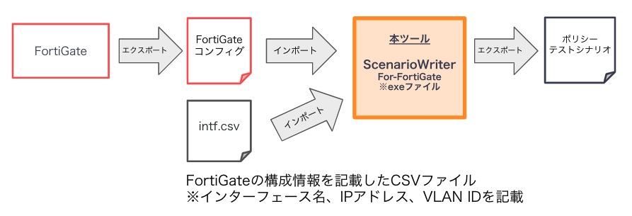

# NEEDLEWORK-ScenarioWriter-For-FortiGate

# はじめにお読みください

本ツールはMITライセンスです。<br>
ライセンスの内容、および下記注意事項・仕様を確認のうえ、同意いただける場合にのみご利用ください。<br><br>

本ツールは支援ツールとして公開しています。<br>
サポートはベストエフォートとなり、動作を保証するものではないことをあらかじめご了承願います。<br>

また、本ツールにプログラミング上の誤りその他の瑕疵のないこと、<br>
本ツールが特定目的に適合すること並びに本ツール及びその利用が利用者または第三者の権利を侵害するものでないこと、<br>
その他いかなる内容の保証も行うものではありません。
本ツールに関して発生するいかなる問題も利用者の責任及び費用負担により解決されるものとします。<br>

# 本ツールについて

本ツールはファイアウォールのコンフィグファイルから[NEEDLEWORK](https://www.ap-com.co.jp/ja/needlework/)で<br>使用するcsv(テストシナリオ)を生成するツールです。<br>以下のファイアウォールに対応しています。

* Fortinet FortiGate <br>
  ※動作確認バージョン：6.0.6, 6.2.10（その他バージョンは動作未検証）

※ Juniper SSG5の場合は下記のツールをご利用ください。 <br>
https://github.com/ap-communications/NEEDLEWORK-ScenarioWriter

# 本ツールが非対応のポリシー

現在、下記に該当するポリシーはツール、またはNEEDLEWORKが非対応のため、出力できません。
* プロトコルオプションが有効なポリシー<br>
※ 今後のアップデートで対応予定です。
* セントラルNATが有効なポリシー<br>
* 送信元・宛先で以下を設定しているポリシー
  * ジオグラフィ
  * ファブリックコネクタアドレス
  * ユーザー（例: SSO_Guest_Users）
  * インターネットサービス（例: Google-Google.Bot）

# 本ツールの仕様について

ツールの仕様につきましては下記をご確認ください。 <br>
https://github.com/ap-communications/NEEDLEWORK-ScenarioWriter-For-FortiGate/blob/master/tool_specification.md

# 本ツールの使用方法

## 使用方法概要



FortiGateのコンフィグとintf.csv（FortiGateの構成情報を記載したCSV。詳細は後述。）を <br>
本ツールにインポート（コマンドの引数として指定します）してツールを実行します。

```
コマンド例：
C:\Users\apc> NEEDLEWORK-ScenarioWriter-For-FortiGate.exe C:\tools\fortigate.conf
※intf.csvは特定のディレクトリ（ツール保存ディレクトリ配下）から自動的に読み込まれます
```

NEEDLEWORKのポリシーテストシナリオ（CSV）が出力されます。

<br><br>
本ツールの利用方法詳細は以下の通りです。<br>

## 動作環境

* OS : Windows 10(64bit)

## 事前準備

1. 下記URLよりzipファイルをダウンロードします。<br>
   ※最新バージョンをご利用ください<br>
    https://github.com/ap-communications/NEEDLEWORK-ScenarioWriter-For-FortiGate/releases
2. ダウンロードしたzipファイルを解凍し、出力されたディレクトリを任意のディレクトリに移動します。 <br>
   ※解凍ディレクトリの中にexeファイルが格納されています
3. configディレクトリ内の`intf.csv`に必要情報を記載します。<br>
  複数のインターフェースを使用している場合は、インターフェースの数分記載をお願いいたします。<br>

### intf.csv記載方法
以下の情報を記載します。<br>
intf.csvとFortiGateコンフィグの内容を突合し、出力するテストシナリオのFW-IP、VLANの値を求めています。<br>
  * FortiGateのインターフェース名
  * インターフェースのIPアドレス
  * インターフェースのサブネットマスク
  * インターフェースのVLAN ID<br><br>
  
`intf.csv`の内容をもとにシナリオを生成しているため、<br>下記を参考に正しいフォーマット・値を記載してください。<br>
* インターフェースのIPアドレス: `A.B.C.D`の形式かつ正常なIPアドレス
* インターフェースのサブネットマスク: `A.B.C.D`の形式かつ正常なサブネットマスク
* インターフェースのVLAN ID: `0~4094`のいずれか

**記載例**
以下のネットワーク構成、インターフェース設定の場合、<br>
次のようにconfigディレクトリ内の`intf.csv`を記載します。 <br><br>
FortiGateのネットワーク構成図<br>


FortiGateのインターフェースの設定画面<br>


`intf.csv`（configディレクトリ内に保存）の記載例:<br>
※ エイリアスを設定しているインターフェースは元のインターフェース名のみを記載してください。<br>
```
inftname,address,subnetmask,vlanid
lan1,192.168.100.254,255.255.255.0,
VLAN10,10.10.10.254,255.255.255.0,10
VLAN20,20.20.20.254,255.255.255.0,20
lan2,10.0.0.254,255.255.255.0
VLAN110,110.110.110.254,255.255.255.0,110
VLAN120,120.120.120.254,255.255.255.0,120
```

## 実行手順

1. コマンドプロンプトを起動し、事前準備でzipファイルを解凍したディレクトリに移動します。
   ```
   cd <zipファイルを解凍したディレクトリのパス>
   ```
2. 下記コマンドをコマンドプロンプトで実行します。
   
    ```
    NEEDLEWORK-ScenarioWriter-For-FortiGate.exe <FortiGateのコンフィグファイル(.conf)のパス>
    ```
    ```
    例：NEEDLEWORK-ScenarioWriter-For-FortiGate.exe config/v6.2.10/sample.conf
    ```
3. コマンドプロンプトに、`csvの生成が完了しました`と表示されると完了です。

# 本ツールで出力されたエラーメッセージ

* 本ツールが正常に終了しない場合は、エラーメッセージが出力されます。<br>
* 詳細は下記をご確認ください。<br>
https://github.com/ap-communications/NEEDLEWORK-ScenarioWriter-For-FortiGate/blob/master/tool_specification.md#%E5%87%BA%E5%8A%9B%E3%81%95%E3%82%8C%E3%82%8B%E3%82%A8%E3%83%A9%E3%83%BC%E3%83%A1%E3%83%83%E3%82%BB%E3%83%BC%E3%82%B8%E3%81%AB%E3%81%A4%E3%81%84%E3%81%A6

# 本ツールで出力されたシナリオを用いてNEEDLEWORKでテストを行う際の注意事項

* 本ツールで出力されたシナリオにFQDNシナリオが含まれる場合、NEEDLEWORKでテストを実行する前に、 <br>
 FortiGateのDNSサーバーのIPにNEEDLEWORKの管理IPアドレス（※）を指定する必要があります。 <br>
※ 仮想アプライアンス版NEEDLEWORKの場合は端末のIPアドレスかつFortiGateから到達性のあるIPアドレス <br>
詳細は下記のNEEDLEWORKの操作マニュアルをご参照ください。<br>
https://support.needlework.jp/manual/

* FQDNシナリオはDescription欄に「ポリシー名 FQDN Policy」が記載されます。 <br>
以下例はポリシー名が`test`のFQDNポリシーをシナリオで出力した場合のDescription欄です。 <br>
例: `policy name = test FQDN Policy`

# FAQ等

* 生成されたシナリオでTCP関連のプロトコルのシナリオがDropになってしまいます。
    * FortiGateがTCPの通信をプロキシし、NEEDLEWORKのテスト結果がDropになる場合があります。<br>
    シナリオのその他設定に`Proxy mode`を指定し、再度テストの実行をお願いします。<br>
    * 現在、下記の条件1, 条件2, 条件3の全てに該当している場合,上記事象を確認しています。<br>
        **条件1:**
        * ポリシーまたはVDOMのインスペクションモードがプロキシベースであること<br>

        **条件2:**
        * ポリシー
            * セキュリティプロファイル
                * アンチウイルス: 有効<br>

        **条件3:**
        * OSバージョン: 6.2.10
        * ポリシー:
            * セキュリティプロファイル
                * SSLインスペクション: SSL/SSHインスペクションプロファイルのプロトコルポートマッピングで指定しているポートに該当している（例: HTTPS 443）<br>

その他ご質問・ご要望等ございましたら下記のフォームまでお願いします。<br>
https://forms.gle/cAT7tBXxcmowjUhf6